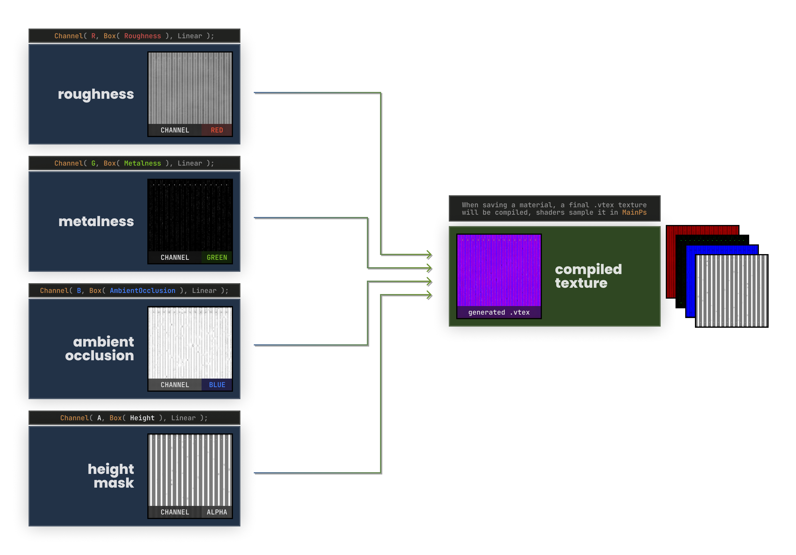
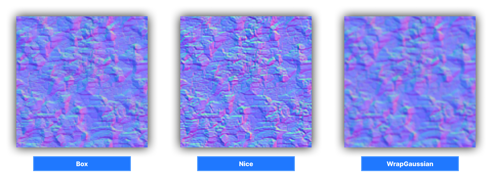

# Attributes and Variables

## What's an attribute

**Attributes** are the bridge to pass information around the CPU to the GPU, like Variables, Textures or entire Buffers.

To declare a constant to be exposed to C# you simply append `< Attribute("Foo"); >;`  to that variable, like for example:

* `bool NoiseEnabled < Attribute("NoiseEnabled"); >;`
* `float4 NoiseScale < Attribute("NoiseScale"); >;`
* `float4x4 BoxTransform < Attribute("BoxTransform"); >;` 
* `Texture2D NoiseTexture < Attribute("NoiseTexture"); >;`

This can then be set from C# side with `Attributes.Set( "Name", variable );`

## **Material Editor Integration**

The Material Editor provides a graphical interface to adjust and control attributes defined in your shaders, By setting a `Default[1..4]()` value it will make it show up on the editor.


Certain attributes can have custom UI behaviors. For instance, `UiType(Color)` turns a float3 into a color picker. Other UI hints can be used to provide default values and ranges.

```csharp
float3 TintColor < UiType(Color); Default3(1.0, 1.0, 1.0) >;
```

### Reference

The following attributes are supported for constants:

`Default(arg1)` or `Default1(arg1)` Defines a variable default1 with the value { arg1 }.

`Default2(arg1, arg2)` Defines a float2/int2 with values { arg1, arg2 }.

`Default3(arg1, arg2, arg3)` Defines a float3/int3 with default values { arg1, arg2, arg3 }.

`Default4(arg1, arg2, arg3, arg4)` Defines a float4 with values { arg1, arg2, arg3, arg4 }.

`Range( arg )` - Limit the UI to this range

`Range2( arg, arg2 )` - Limits the UI of a float2/int2 to this range

`Range3( arg, arg2, arg3 )` - Limits the UI of a float2/int2 to this range

`Range4( arg, arg2, arg3, arg4 )` - Limits the UI of a float2/int2 to this range

`UIType( type )` - Explicitly set which UI type to use for this variable

* `Slider`
* `Color`
* `CheckBox`

`DefaultFile( arg )` - Defaults to this file if none is specified, for Textures

## **Textures**

You can define an image to use on the material editor UI as follows:

```csharp
CreateInputTexture2D(
    Name, 
    ColorSpace,           // Color space: Linear or SRGB
    Precision,            // Precision per channel (e.g. 8 for 8-bit)
    Format,               // Format (e.g., DXT5, BC7)
    "Suffix",             // File suffix to filter in the UI
    "Group,1/10",         // UI group and ordering
    Default(0.5)          // Default value if none is provided
);
```

For example, this will create an "AlbedoImage" that can be exposed to the texture for compiling, the UI will filter for images that end with `_albedo` suffix:

```csharp
CreateInputTexture2D( AlbedoImage, Linear, 8, "", "_albedo", "Material,10/30", Default( 0.5 ) );
```

To expose the compiled texture from UI into a Texture2D you can use the following:

```csharp
Texture2D Albedo < Channel( RGBA, Box( AlbedoImage ), Srgb ); OutputFormat( BC7 ); >;
```

This compiles an image into a texture using box filtering for mipmaps.

### Advanced Channel Usage

You can pack channels of multiple images into a single texture specifying which channel the image will be sampled from

```csharp
Texture2D RMA < Channel( R, Box( Roughness ), Linear ); 
                Channel( G, Box( Metalness ), Linear ); 
                Channel( B, Box( Occlusion ), Linear );  
                Channel( A, Box( BlendMask ), Linear ); >;
```

**What is it for?** When saving a material, editor will refer to this attribute data from your shader to see how each texture input must be compiled. So, for example, if you have **roughness**, **metalness**, **ambient occlusion** and **height mask** texture inputs assigned to **red**, **green**, **blue** and **alpha** channels of your `Texture2D` accordingly, it will generate one compiled `.vtex` texture file with all of these maps packed together. 



You can assign any combination of channels for one texture input this way, you decide how these channels will be utilized. For example, you can assign a color/normal map to `RGB` and some single-channel texture to `A` in one texture. If you have a specific texture that uses two color maps, you can put it in `RG`, and then use remaining green and alpha channels for anything else.

It's a very versatile way to minimize the amount of texture files in a compiled material.

### Output Format

Another special attribute in **Texture2D** creation is `OutputFormat`. It will tell the texture compiler which image format (and compression method) will be used for it. The most common ones are `DXT5` and `BC7`, but there are more formats available for use: 

| Format | Description |
|--------|-------------|
| `DXT1` | Compressed texture format with no alpha |
| `DXT3` | Compressed texture format with alpha |
| `DXT5` | Compressed texture format with alpha, generally better than **DXT3** |
| `BC6H` | Compressed texture format with *HDR color* in 16 bit depth, no alpha | 
| `BC7`  | Compressed texture format with alpha, most commonly used one | 

There is also technically nothing stopping you from using other image formats, such as `I8`, `RGBA8888`, `R16`, `RG1616`, `RGBA16161616`, `R32F` etc. but it is generally recommened to use compressed texture formats above for materials.

## **Mip Generators**

:::warning
💩 **Obscure/old features - everything in this section provided as-is.** You're free to use this information if you agree to following conditions: 1) it may break in the future, anytime, for any reason, 2) you're ok with that fact. 

:::

Second argument in `Channel()` macro is the mip generation method. Most common one is `Box`, which simply creates mips with box filtering. This is what you should use most of the time anyway. Here is a list of other commonly used methods: 

| Mipmap Method | Description |
|---------------|-------------|
| `Box( TexA )` | Generate mips with simple box filtering |
| `PreserveCoverage( TexA )` | Preserves opacity coverage for each mip, nice for transparent textures that must maintain detail on every mip level |
| `AlphaWeighted( Color, Opacity )` | Computes special mips for color maps by weighing the opacity texture. Lower mips "extrude" the color map based on opacity mask, which eliminates some issues with texture accuracy at lower mips. Takes two textures. |

And there is also a number of other mip generators which are listed here just for the reference. 

| Mipmap Method | Description |
|---------------|-------------|
| `None( TexA )` | Don't generate mips for this texture |
| `MultiplyBox( TexA, TexB )` | Multiplies two texture inputs together and then generates mips using box filtering |
| `MultiplyNoMip( TexA, TexB )` | Same as `Multiply`, but won't generate any mips | 
| `HemiOctNormal( TexA )` | Takes regular RGB tangent normal map and then applies hemispheric octahedron normal map encoding which will be stored into **green** and **alpha**. If you don't have these channels selected in **Channel** macro, then it will not work correctly |
| `HemiOctIsoRoughness_RG_B( TexA )` | ... |
| `HemiOctAnisoRoughness_RG_BA( TexA )` | ... |
| `AnisoRoughness_RG( TexA )` | ... | 
| `HemiOctAnisoRoughness( Normal, Roughness )` | ... |
| `AnisoNormal( TexA )` | ... | 
| `AnisoNormalRoughness( Normal, Roughness )` | ... |
| `Nice( TexA )` | Pretty close to box filtering, but mips are sharper |
| `AutoLevels( TexA )` | Generates mips using box filtering and then applies autolevel color adjustments, think of it like Photoshop effect where it automatically tries to balance out the color range | 
| `BoxInverse( TexA )` | Generate mips with simple box filtering, but the result texture is inverted | 
| `BoxN( TexA )` | Where N = number of max mips. So if you do `Box2( Texture )`, you will have only two mip levels. Uses box filtering. |
| `WrapGaussian( TexA )` | Mips with gaussian blur |
| `HeightCombine( HeightA, HeightB )` | Generates mips and combines two heightmaps together |

### Some Mips Previews

* **ALPHA WEIGHTED: RGB Color map**


* **VARIOUS NORMAL PROCESSING METHODS:** Box, HemiOctNormal (Green & Alpha), AnisoNormalRoughness


* **BOX, NICE AND WRAPGAUSSIAN**


## **Shader Attributes**

:::warning
💩 **Obscure/old features - everything in this section provided as-is.** You're free to use this information if you agree to following conditions: 1) it may break in the future, anytime, for any reason, 2) you're ok with that fact. 

:::

In some shaders you may find such things as `BoolAttribute` and `TextureAttribute`. This is special attribute data which is read by engine for various rendering/utility purposes. In most cases you do not need to worry about them, but they are still listed here for the reference in case you ever wonder what are they doing in shader source code.

### Bool Attributes

| Bool Attribute | Description |
|----------------|-------------|
| translucent | Marks material as translucent, disables shadows, required for proper transparency. Can quickly access this attribute in C# using `Flags.IsTranslucent` |
| alphatest | Indicates that shader has alpha test enabled. Can quickly access this flag in C# using `Flags.IsAlphaTest` |
| sky | Indicates that this shader represents a skybox. Can quickly access this flag in C# using `Flags.IsSky` |
| SupportsMappingDimensions | If set to **true**, Material Editor will add settings for world mapping in "Attributes" tab. May be useful if you are using Hammer. |
| bWantsFBCopyTexture | Indicates that scene object needs a copy of frame buffer texture. Must be set to **true** if you want to read frame buffer texture in your shader. |
| NoZPrepass | If **true**, objects with your shader will opt out of Z prepass |
| DoNotCastShadows | This should disable shadow rendering on given material, but I don't know if this still works. TODO |

### Texture Attributes

Unless you plan to build your maps with Hammer and bake lightmaps, most of these texture attributes will be useless for you. It may be handy to use `RepresentativeTexture` for now though.

| Texture Attribute | Description |
|-------------------|-------------|
| RepresentativeTexture | This is used to display a 'representative' texture in number of tools, for example fast texturing tool. It will be displayed in tools when working with a material that uses your shader. |
| LightSim_DiffuseAlbedoTexture | Represents the albedo/diffuse texture for light baking in Hammer |
| LightSim_Opacity_A | Represents the opacity mask texture for light baking in Hammer |
| LightSim_SelfIllumMaskTexture | Represents the emissive texture for light baking in Hammer |

### Float Attributes

You can assign `float` and `float3` attributes from your code using `FloatAttribute` and `Float3Attribute` accordingly. Just like with texture attributes, most of them are used for the Hammer light baking - so you will not find any of these useful unless you plan to build & bake light maps in Hammer. 

| Float Attribute | Description |
|-----------------|-------------|
| `Float` LightSim_SelfIllumScale | Sets the intensity of emissive map for light baker in Hammer |
| `Float3` LightSim_SelfIllumTint | Sets the tint color of emissive map for light baker in Hammer | 

### Usage

These attributes are primarily read by native C++ engine, however in s&box you can also read the values using `Flags` in **Material** class, using `GetInt` and `GetFloat`:

```cpp
BoolAttribute( SomeValueAttributeFromShader, false ); 
FloatAttribute( SomeFloatAttributeFromShader, 34.5f );
```

```csharp
var myValue = material.Flags.GetInt( "SomeValueAttributeFromShader" );
var myFloat = material.Flags.GetFloat( "SomeFloatAttributeFromShader" );
```

## **GPU Buffers**

If you want to send a lot of information at once you can use Constant Buffers or Structured Buffers:

```csharp
private struct Constants
{
    public Vector4 Foo;
    public Vector4 Bar;
}

private Rendering.CommandList ConstantsCommandList()
{
    Rendering.CommandList commands = new("Example Commmand List");
    
    var constants = new Constants();
    
    constants.Foo = new Vector4( 0.0f, 1.0f, 2.0f, 3.0f );
    constants.Bar = new Vector4( 4.0f, 5.0f, 6.0f, 7.0f );
    
    commands.Attributes.SetData( "Constants", constants );
    
    return commands;
}
```

And in the shader it can just be defined as mirrored on C#, for Constant Buffers the attribute binding for it's name is already implicitly set.

```csharp
cbuffer Constants
{
    float4 Foo;
    float4 Bar;
}
```

## **Attributes on SceneObjects**

You can set attributes of a specific SceneObject, this will affect the materials that are being used on that object when rendering, it does not need to be in a render block.

```csharp
	void UpdateObject()
	{
		if ( !_sceneObject.IsValid() )
			return;

		_sceneObject.Attributes.SetCombo( "D_COMBO", 1 );
		_sceneObject.Attributes.Set( "Foo", 1.0f );
		_sceneObject.Attributes.Set( "Bar", new Vector4( 1.0f, 2.0f, 3.0f, 4.0f ) );
		_sceneObject.Attributes.Set( "NoiseTexture", NoiseTexture );
	}
```

## **Attributes on Command Lists**

You can use attributes on the entire render context or the rest of the pipeline when you set them on a [Command List](/rendering/shaders/command-lists.md).

```csharp
protected override void OnEnabled()
{
    Camera.AddCommandList( ExampleCommandList(), Rendering.Stage.AfterDepthPrepass );
}
   
private Rendering.CommandList ExampleCommandList()
{
    Rendering.CommandList commands = new("Example Commmand List");
    
    var compute = new ComputeShader( "example_cs" );

    commands.Set( "NoiseScale", NoiseScale );
    commands.Set( "NoiseTexture", NoiseTexture );
        
	commands.DispatchCompute( compute, ExampleRenderTarget.Size );
 
    // Sets attribute for anything after Rendering.Stage.AfterDepthPrepass 
    // until end of frame for this view from the result of the compute operation
    commands.Attributes.Set( "Result", ExampleRenderTarget );
 
    return commands;
}
```
