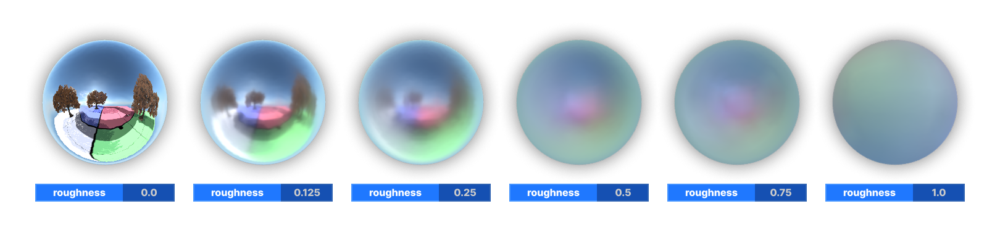

# Environment Map

`EnvMap` class allows easily sampling environment probes that are present on your scene, with appropriate mip level (if roughness is set) and clustered culling. 

```cpp
float3 From( float3 WorldPosition, float4 PositionSs, float3 WorldNormal, float2 Roughness = 0.0f )

```
* `WorldPosition`: world-space pixel position (`i.vPositionWithOffsetWs` + `g_vCameraPositionWs` if you use standard pixel input struct)
* `PositionSs`: screen position (`i.vPositionSs` in standard pixel input struct)
* `WorldNormal`: world-space geometry normals
* `Roughness`: surface roughness, **0** is highest mip level and **1** is the lowest.


