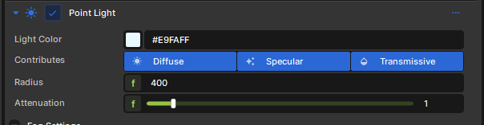

# Light

If you want to access lighting information directly you can use this.

# Lights

Lights can be easily accessed using this class, this already implies going over the surface of what's being drawn.

```cpp
struct Light
{
    // The color is an RGB value in the linear sRGB color space.
    float3 Color;

    // The normalized light vector, in world space (direction from the
    // current fragment's position to the light).
    float3 Direction;

    // The position of the light in world space. This value is the same as
    // Direction for directional lights.
    float3 Position;

    // Attenuation of the light based on the distance from the current
    // fragment to the light in world space. This value between 0.0 and 1.0
    // is computed differently for each type of light (it's always 1.0 for
    // directional lights).
    float Attenuation;

    // Visibility factor computed from shadow maps or other occlusion data
    // specific to the light being evaluated. This value is between 0.0 and
    // 1.0.
    float Visibility;

    // Every light object contains binary light data, this is raw information that
    // comes from the scene in the CPU. See below for more details. 
    BinnedLight LightData;

    // Gets the light structure given the screen-space and world position and
    // the light index.
    static Light From( float4 vPositionSs, float3 vPositionWs, uint nLightIndex );
    
    // Number of lights in the current fragment.
    static uint Count( float2 vPositionSs );
};
```
### Iterating over all lights

```cpp
for( int i=0; i < Light::Count(); i++ )
{
    Light l = Light::From( ScreenPosition, WorldPosition, i );
    ...
}
```

This iterates both Dynamic and Static lights, this does all you need and returns with all optimizations from Frustum Tiled Lighting

### Diffuse, Specular and Transmissive

In the editor, every light component supports toggling various kinds of lighting contributions: diffuse, specular, and transmissive. If you are writing your shading model, this may be useful for you. 



You can check if current light in the iteration has diffuse/specular/transmissive enabled by accessing object's raw `BinnedLight` data:

```cpp
LightData.IsDiffuseEnabled();
LightData.IsSpecularEnabled();
LightData.IsTransmissiveEnabled();
```

```cpp
// Iterate through every available light source in cluster
for( int i = 0; i < Light::Count(); i++ )
{
    // Get the light object for current iteration 
    Light light = Light::From( ScreenPosition, WorldPosition, i );

    // Check if current light has diffuse enabled
    if ( light.LightData.IsDiffuseEnabled() )
    {
        // <...>
    }

    // Check if current light has specular enabled
    if ( light.LightData.IsSpecularEnabled() )
    {
        // <...>
    }

    if ( light.LightData.IsTransmissiveEnabled() )
    {
        // <...>
    }
}
```

### Light Types

If you need to check whether your current light is point, spot, or directional, you can do this by accessing its raw data from `LightData`. Additionally, you can use a fancy enum that references all available light types. 

```cpp
enum LightType
{
    LightTypePoint = 1,
    LightTypeDirectional = 2,
    LightTypeSpot = 3,
    LightTypeRect = 4
};
```
Here's a code example: 

```cpp
// Check if current light is a point
if ( light.LightData.Type == LightType::LightTypePoint )
{
    // ...
}

// Check if current light is directional (sun)
if ( light.LightData.Type == LightType::LightTypeDirectional )
{
    // ... 
}
```

# Directional Lights

Directional lights have a slightly unique implementation. To fetch sun's color and direction, you can use following constants:

```cpp
float4 g_DirectionalLightColor;     // XYZ = color, W = fog strength
float4 g_DirectionalLightDirection; // XYZ = direction vector, W = blank 
```

This data can be accessed from anywhere, even when you are not iterating lights in a loop. 

### Sampling sun shadows

Directional lights have their own shadow path, so if you want to sample a shadow that is being cast by sun, you should use `DirectionalLightShadow` class: 

```cpp
float flDirLightShadow = DirectionalLightShadow::GetVisibility( WorldPosition, ScreenPosition.xy );
```

# Binned Lights

This is the raw, internal information of lights that comes from the scene in the CPU, listed here for reference.

```cpp
class BinnedLight
{
    uint Type;          // 1 = spot, 2 = point, 3 = rect, etc..
    LightShape Shape;  
    uint Flags;

    float4x4 LightToWorld;

    float3 Color;
    float LinearFalloff;
    float QuadraticFalloff;
    float FalloffBias;
    float Radius;
    float RadiusSquared;
    float2 ShapeSize;

    float4 SpotLightInnerOuterConeCosines; // x - inner cone, y - outer cone, z - reciprocal between inner and outer angle, w - Tangent of outer angle
    float FogIntensity;
    uint ShadowMapIndex;            // Index in the shadow array, 0xFFFFFFFF if no shadow
    uint LightCookieTextureIndex;   // Light Cookies, fancy image projection on light, 0xFFFFFFFF if no cookie
    uint ShadowMaskTextureIndex;    // Custom shadow techniques precomputed on compute shader, RT, Screenspace shadows, Capsules, etc, 0xFFFFFFFF if no shadow mask, otherwise index in bindless array
    
	float3 GetPosition() 			{ return LightToWorld[3].xyz; }
	float3 GetDirection() 			{ return LightToWorld[0].xyz; }
	float3 GetDirectionUp() 		{ return LightToWorld[1].xyz; }

    bool IsSpotLight()              { return ( SpotLightInnerOuterConeCosines.x != 0.0f ); }
    bool IsDiffuseEnabled()         { return ( Flags & LightFlags::DiffuseEnabled ) != 0; }
    bool IsSpecularEnabled()        { return ( Flags & LightFlags::SpecularEnabled ) != 0; }
	bool IsTransmissiveEnabled() 	{ return ( Flags & LightFlags::TransmissiveEnabled ) != 0; }
    bool HasDynamicShadows() 	    { return ( ShadowMapIndex != 0xFFFFFFFF ); }
    bool HasLightCookie()           { return ( Flags & LightFlags::LightCookieEnabled ) != 0; }
	bool HasFogShadows()            { return ( Flags & LightFlags::NoFogShadows ) == 0; }
    bool IsIndexedLight()           { return ( Flags & LightFlags::IndexedLight ) != 0; }

    Texture2D GetLightCookieTexture()   { return Bindless::GetTexture2D( LightCookieTextureIndex ); }
};

StructuredBuffer<BinnedLight> BinnedLightBuffer < Attribute( "BinnedLightBuffer" );  > ;

BinnedLight DynamicLightConstantByIndex( int index )
{
    return BinnedLightBuffer[ index ];
}

BinnedLight BakedIndexedLightConstantByIndex( int index )
{
    return BinnedLightBuffer[ BakedLightIndexMapping[index].x ];
}
```
