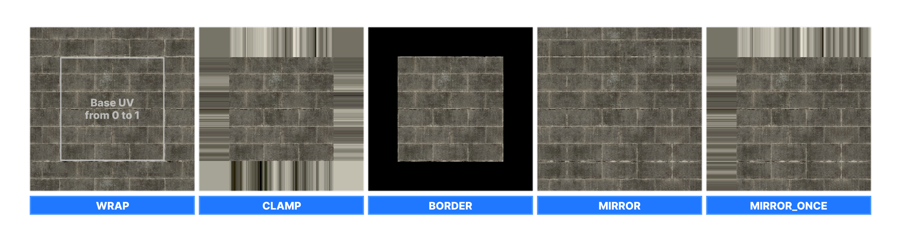

# Sampler States

Sampler states control how textures are sampled in shaders, how they're filtered and addressed.

Modern GPUs allow binding of 128 textures in a shader, however you are limited to only 16 bound samplers.
This is generally more than enough if you reuse samplers for multiple textures.

Sampler states are defined as you normally would in HLSL, but should be annotated with the desired options.

```csharp
Texture2D MyCoolTexture;
Texture2D MyOtherCoolTexture;
SamplerState MyPixelySampler < Filter( Point ); >;

// Using the samplers
float4 color1 = MyCoolTexture.Sample( MyPixelySampler, uv );
float4 color2 = MyOtherCoolTexture.Sample( MyPixelySampler, uv );
```

## Annotations

| Annotation | Description | Possible Values |
|------------|-------------|-----------------|
| Filter     | Filtering mode used for texture sampling. | Point, Bilinear, Trilinear, Anisotropic, see **Filters** section for more |
| AddressU   | Texture coordinate addressing mode for the U direction. | Wrap, Mirror, Clamp, Border, Mirror_Once |
| AddressV   | Texture coordinate addressing mode for the V direction. | Wrap, Mirror, Clamp, Border, Mirror_Once |
| AddressW   | Texture coordinate addressing mode for the W direction. | Wrap, Mirror, Clamp, Border, Mirror_Once |
| MaxAniso   | Maximum anisotropy level allowed for anisotropic filtering. | Integer value (e.g., 2, 4, 8, 16, etc.) |

### Address Modes

Address mode affects how texture sampling is handled outside of 0-1 UV range. 

| Address Mode | Description |
| Wrap | Repeats the texture infinitely |
| Clamp | Extrudes the edges of texture infinitely |  
| Border | Simply cuts off everything outside of 0-1 range |
| Mirror | Repeats the texture infinitely, but each repeat is mirrored | 
| Mirror_Once | Repeats and mirrors the texture, but only once, and only in one direction, otherwise it's clamped | 



### Filters

| Enum | Description |
|------|-------------|
| Point | Same as MinMagMipPoint |
| Bilinear | Same as MinMagLinearMipPoint |
| Trilinear | Same as MinMagMipLinear |
| Anisotropic | Anisotropic filtering, controlled by MaxAniso |
| MinMagMipPoint | Minify/magnify/mipmap using point sampling. |
| MinMagPointMipLinear | Minify/magnify using point sampling, mipmap using linear interpolation. |
| MinPointMagLinearMipPoint | Minify using point sampling, magnify using linear sampling, mipmap using point sampling. |
| MinPointMagMipLinear | Minify using point sampling, magnify using point sampling, mipmap using linear interpolation. |
| MinLinearMagMipPoint | Minify using linear interpolation, magnify using point sampling, mipmap using point sampling. |
| MinLinearMagPointMipLinear | Minify using linear interpolation, magnify using point sampling, mipmap using linear interpolation. |
| MinMagLinearMipPoint | Minify/magnify using linear sampling, mipmap using point sampling. |
| MinMagMipLinear | Minify/magnify/mipmap using linear interpolation. |
| ComparisonMinMagMipPoint | Comparison minify/magnify/mipmap using point sampling. |
| ComparisonMinMagPointMipLinear | Comparison minify/magnify using point sampling, mipmap using linear interpolation. |
| ComparisonMinPointMagLinearMipPoint | Comparison minify using point sampling, magnify using linear sampling, mipmap using point sampling. |
| ComparisonMinPointMagMipLinear | Comparison minify using point sampling, magnify using point sampling, mipmap using linear interpolation. |
| ComparisonMinLinearMagMipPoint | Comparison minify using linear interpolation, magnify using point sampling, mipmap using point sampling. |
| ComparisonMinLinearMagPointMipLinear | Comparison minify using linear interpolation, magnify using point sampling, mipmap using linear interpolation. |
| ComparisonMinMagLinearMipPoint | Comparison minify/magnify using linear sampling, mipmap using point sampling. |
| ComparisonMinMagMipLinear | Comparison minify/magnify/mipmap using linear interpolation. |
| ComparisonAnisotropic | Comparison anisotropic filtering. |

# Common Samplers

Here are some common predefined sampler states you can use in your shaders.

| Sampler State | Description |
|---------------|-------------|
| g_sAniso      | Anisotropic filtering with a maximum anisotropy level of 8. |
| g_sBilinearClamp | Bilinear filtering with texture coordinate addressing mode set to clamp for U, V, and W directions. |
| g_sBilinearWrap | Bilinear filtering with texture coordinate addressing mode set to wrap for U, V, and W directions. |
| g_sBilinearMirror | Bilinear filtering with texture coordinate addressing mode set to mirror for U, V, and W directions. |
| g_sTrilinearWrap | Trilinear filtering with texture coordinate addressing mode set to wrap for U, V, and W directions. |
| g_sTrilinearClamp | Trilinear filtering with texture coordinate addressing mode set to clamp for U, V, and W directions. |
| g_sTrilinearMirror | Trilinear filtering with texture coordinate addressing mode set to mirror for U, V and W directions. |
| g_sTrilinearBorder | Trilinear filtering with texture coordinate addressing mode set to border for U, V and W directions. |
| g_sPointClamp | Point filtering with texture coordinate addressing mode set to clamp for U, V, and W directions. |
| g_sPointWrap  | Point filtering with texture coordinate addressing mode set to wrap for U and V directions |
| g_sPointMirror | Point filtering with texture coordinate addressing mode set to mirror for U and V directions | 

:::warning
CreateTexture2D & Tex2D macros create and sample coupled textures and samplers, this is how it worked for older graphics APIs (DX9) and should be avoided due to it's limitations.

:::
